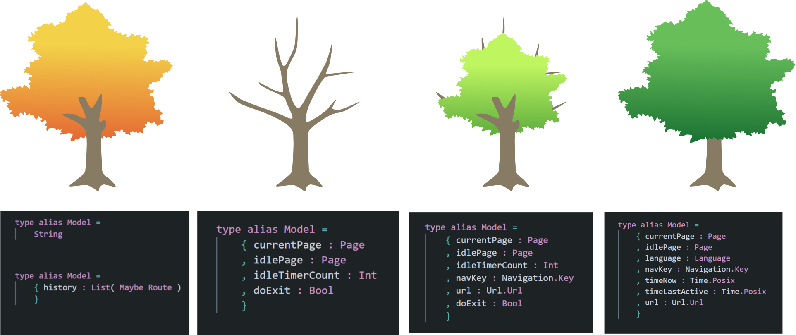
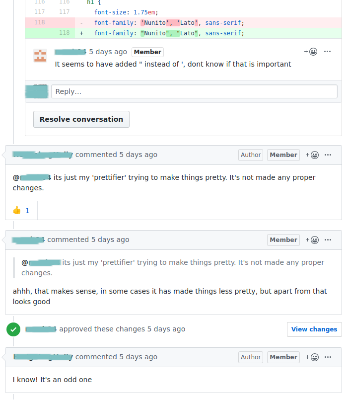

# Growing an Elm app with the whole team

---

## Katja Mordaunt

I like being nice & getting good stuff done.

Note:
- Developing software in small teams over decade with Neontribe. Work with non-profits to build digital tools that compliment their over-stretched services
- also raising children for a 1/4 century & dabbled film industry
- Noticed things about how people work together/ behave in groups/ treat each other& been involved in projects that break down because of communication
- Going to share some practical tips - and talk about how and why I think Elm helps make happier, more productive teams
- Much of talk, things you know - but important to give teams & people confidence to spend effort making a "be nice" atmosphere. Maybe I'll say something didn't know too!
- Anyway if you know all this stuff - hopefully make you feel good about what you are already doing.

---

## 2 years ago...

New project!

~~python, php, wordpress, drupal, symfony, laravel~~<!-- .element class="fragment" -->

jquery... handlebars... angular... vue...<!--.element class="fragment" -->

<!--.element class="fragment" -->

Note:
- Usually projects have lead front and lead back - I was backend lead
- TICK: Budget justify only 1 lead. After discovery - no backend.
- TICK: I'd been down the jquey, handlebars, angular, vue route and was suspiscious of js
- Not confident I wouldn't make a mess
- Same time was playing with clojure and haskell and feeling like funtional was a safe / predictable space
- TICK: Someone mentioned Elm

+++

## So we're going with Elm?

Note:
- App is tool uses stories, illustrations&  bite sized info to help victims of domestic violence gain the confidence to get in touch for help. Essentially simple structure.
- TICK: Had ups and downs. Conversations around Elm being the wrong tool / over-engineering
- syntax confusing - Ironically, exp devs seem to have more trouble reading Elm than beginners
- Made me reflect that we need to learn to trust each other's tech - and knowlegde & ability to evaluate and make choices in good faith
- I tried to explain that - yes Elm can make more complex apps safer but it's also a solid foundaiton for any UI
- Unfortunately not everyone agreed with me but we shipped... and most of the company forgot about it.

+++

## All happily going about our work

"Is there anything anyone needs help with?" - Illustrator <!-- .element class="fragment" data-fragment-index="1" -->

Note:
- One year on - Success, with users
- Translate the original & funder asked white label? and roll out clones?
- Manager I think we can handle the translation & upgrade
- Maybe better port the app to html/js for the clones so other people can work on it?
- Manager was thinking in terms of labels but
- But precisely because it was in Elm, I had a hunch I'd be able to rely on people in my team who didn't yet identify themselves as coders.
- TICK: So when Holly - who'd been with us for 3 months, stepped forward after standup...
- Yes! There is something I need help with.

---

## Stumbling down the path together...
<!-- .element class="fragment" data-fragment-index="1" -->

with Holly!<!-- .element class="fragment" data-fragment-index="1" -->

Note:
- Historically Neontribe - was a bunch of devs - diff bg
- Between us took care of non-dev work, recently hired a few people with little/no coding exp support with those tasks
- Those new hires had a bit more time on their hands
- So we set off: Myself and other dev who'd worked on the original app, user researcher with a maths degree who'd done a bit of coding and had lots of exp in the charity sector - to lead the discovery and liaise with clients
- TICK: and of course, Holly a recent arts graduate and illustrator who wanted to help
- We hit all the same problems every software project has...
- It didn't all go swimmingly .. but this is what worked well and how Holly helped me reflect on where our process could be better

---

## The beginners on your team will appreciate guidance
- What do new team members need to know<!-- .element class="fragment" data-fragment-index="1" -->
- Check in regularly<!-- .element class="fragment" data-fragment-index="2" -->
- Set guidelines for code review<!-- .element class="fragment" data-fragment-index="3" -->
- Talk about how to talk about code<!-- .element class="fragment" data-fragment-index="4" -->

Note:
- (6) Now that we had Holly on board - Came up with common sense framework 
- TICK: Keep minimal - what new team members need to know
- TICK: Have short converstions often
- TICK: Can't say for your situation - Code review for beginners easier in Elm. Guidelines give newcomers more confidence. (e.g. changes to the model, does it introduce duplication? Richard Feldman elm conf 2018, naming Ally Kelly McKnight Elm 2018, Seiya Izumi Code review strategy elm eu 2019) onboarding to biggest elm app in japan
- TICK: Felienne Hermans how code sounds: even simple like dash, hyphen, minus contextual

+++

## Beginners welcome
We need beginners in our community and in our teams to keep them healthy

Note:
- Just like organisations& projects& teams need new people with fresh perspectives,
- Our communities need them too...
- I am proud to be a member of London Elm Code meetup
- Mario does a great job of making newcomers feel welcome and does an amazing job of tayloring the content to the people who show up whatever their background
- In fact, the invitation is so open and welcoming that people who don't know what Elm is, but are interested in starting out in coding. sometimes accidently find themselves there.
- And we like that!

+++

## Brand new to coding

- Elm + text editor<!-- .element class="fragment" -->

Note:
- (10) When Holly first joined project - didn't have a dev environ set up - I didn't think that should be a barrier I even got our testing manager to submit directly to github when noticed there were no issue templates.
- Often first issues are about editing existing copy and anyway we are dealing in plain text files.
- TICK: With Elm, new developers and non-developers productive quickly. Framework doesn't get in the way - easy to set up - no massive boilerplate to navigate round, no complicated toolchain to understand
- Colleague recently remarked what a shame programmers can no longer do things like configure a postfix server.
- Made me think how great that we no longer need to know how to write safe js in order to be good at our jobs

---

## Everyone's voice 

What is the value in being competative?<!-- .element class="fragment" -->

... especially within our own teams<!-- .element class="fragment" -->

Collaboration is the opposite of heroic leadership<!-- .element class="fragment" -->

Note:
- Once Holly was set up - she started submitting more than just copy changes.
- I remembered a time when another colleague had been coding for about a year - one day he said - seems like all we do every day is go round in circles rewriting each other's code in our own style
- TICK: TICK: Sometimes these refectors are important and sometimes they aren't. As with everything I am saying - the important thing is to consider what you are doing and why - in the context of your circumstance.
- "because of his experience, I was careful to try and let Holly do it her way and not tidy up after her"
- TICK: Collaboration means everything should not be in your style and the project's style should evolve

+++

## Have conversations 
<!-- .element class="fragment" style="max-width: 420px" -->

<!-- .element class="fragment" -->

Note:
- When Holly first contributing to code review, she didn't say much.
- That's common experiece I think
- TICK: We talked about not being afraid to write more than "Looks good" + emoji in code reviews
- She got more confident in her responses.
- Sometimes you come across code you don't understand - don't rewrite it or ignore it - Ask about it. Have a conversation.
- TICK: I like this one between Holly that user researcher I mentioned earlier - READ

+++

## Team style not indy style

<blockquote class="fragment">"You must have faith in your colleagues' competence and good intentions. Very likely the problem you perceive is an indication of tradeoffs you don't yet understand" - Rupert (Neontribe)</blockquote>

Note:
- Declarative style of Elm allows people to discover own "how". Many routes to same endpoint. Give everyone ownership of own journey - don't instruct on how, give them a framework that guides them - be happier. When Holly comes back to this codebase in 6 months, appreciate she had a hand in these decisions - and was allowed to wander
- We don't often take perfect path first time round, nor do we often take decisions without thinking.
- TICK: My colleague Rupert sums that up...
- More people in the team means less burden on the individual & can be outside of core team and be for bouncing ideas off occassionally or jump in when deadlines loom.
- Remember that sometimes things made along time ago or in a hurry (always a story). All capable of making mistakes

+++

## Different perspectives

<!-- .element class="fragment" -->

Note:
- Valuable learning exp with colleague from original Elm project. Safety for users in violent/abusive relationships
- Tick/sync- sleep timer with ID, track recent. TICK:READ
- Because of that I am not so quick to dismiss the thoughts of newcomers to the project - no matter what exp
- Everyone's voice is valid. Sometimes with less knowledge, we can point out a much simpler way.
- Especially if we are looking at a small part of the big picture in collaboration. More overview sometimes makes it seem more complicated than it needs to be.
- Those people with the new ideas - might only say them once very quietly. Listen out.
- It's important to remember to trust your team.

---

## Language forms culture

<!-- .element class="fragment right" -->

Team without labels is just "team"<!-- .element class="fragment" -->

Note:
- Remember pic of my team? If we'd stuck to thinking of Holly as an illustrator - probably not able to deliver project on time
- If you label something as X... people will be lazy about assigning value/ use cases to it. If you don't label, people use own experience/ imagination/ intuition to assess capability of that person or thing
- Sometimes our job titles can erode or inflate our self esteem
- TICK: One thing we had success with recently was to to remove some of the vocab that was diminishing peoples identity.
- TICK: If your company supports this idea you should be able to get everyone into position where words like trainee and junior no longer apply within months of joining team they can be 'a developer'

+++

## Labels can be confusing

Sometimes we assign them to ourselves <!-- .element class="fragment" data-fragment-index="0" -->

...and sometimes others label us.<!-- .element class="fragment" data-fragment-index="0" -->

Note:
- (20) Rockstars: veteran=learned stuff over time, bit by bit=unforgettable knowledge(probably use but might not know - nuemerym, base64), baby=natural skill
- TICK: Labels can be put there by self or others: self tagged=someone who doesn't know what they don't know, boss tagged=pressure to cover gaps in knowledge/keep up appearance of deep knowledge.
- Kids expect us to be able to do everything. So bosses who have labelled you.
- Guilty of that with Holly + illustrator skills
- Sometimes they can be a useful part of the picture - but careful. Not the whole picture.

+++

## Elm (language and the community) encourages inclusivity & collaboration
Instead of "Oh, no, this is too difficult for you" 

... we can say "Sure, let me explain"

Note:
- Prototyping in paper means you don't have to "get it right" the first time. Elm has that too. Trainee never coded before, confident to let them loose. Hardly had to explain anything.
- Supportive compiler etc... mitigates fear of failure and makes us more equal (Emma Cunningham Elm EU)
- Elm good language for communicating ideas to different types of "expertese" or "experience" (Jono Mallanyk Elm EU)
- Much of engineering constraints taken care of by constraints of Elm

---

## Code for people
"Mum, you are not a computer..."

"OK, thanks google."

Note:
- (25) My daughter likes to remind me that I am not a robot
- From the lists I made when I was a kid, I'm not so sure...
- There were certainly times where I was talking to Holly saying things like thats just a function and that's a type, you can use them in the view.. and then had to pause "You're not following, are you? Nope.
- We do need to remember we are humans, not robots - both when we speak to each other and when writing the code.
- Think about the future readers and writers of your codebase
- Our efficiancy needs are different to theirs.
- refactor/ review should focus on making easier for everyone
- The people matter more than the cleverness of the code.

+++

## Naming stuff blah, blah, blah...
Naming stuff is hard<!-- .element class="fragment" -->

... but refactoring in Elm is easy!<!-- .element class="fragment" -->

Note:
- TICK: True - decisions are hard.
- I encouraged Holly let the names start off how she thought of them and let them evolve naturally
- Instead of saying make a thing called this that does that, I framed tasks as... make a thing that does this.
- Encouraging Holly to name stuff without hesitation, meant I could know more about what she was thinking and how much she understood about what the code was doing.
- TICK: and besides, renaming stuff in Elm is fun, not scary.

---

## Nature of bugs

<!-- .element class="fragment" -->

<!-- .element class="fragment" -->

Note:
- Remember when I said it didn't matter that Holly had no ide when she started - not entirely true.
- We were i18n another app at the same time in vue. curly left off. review. merge.
- manual testor visited the page. Similar error was caught at deploy with Elm... still got merged in.
- Keys file also good for copy. Anyone can edit, 1/2 way to cms - don't need the extra mapping layer
- There will be bugs - but catching them at compile time is great

+++

## Elm helps "You got this" for future us

- Functional pieces are atomic<!-- .element class="fragment" -->
- Easy to read the code and see what it does<!-- .element class="fragment" -->

Note:
- For all of us, not just people like Holly who are new to coding. Important when you come back to code or pass it on, able to understand it. So if your code confuses another developer - no matter what their level of experience, consider adding comments - why you did it that way. Remember we don't all have knowledge of all the domains we work in all the time.
- TICK: It helps in Elm someone can fix/implement a part without knowing the whole. No hidden effects, nuances.
- TICK: No behind the scenes magic. More predicatble and encourages us to be delibrately verbose. The only magic is turning it into amazing javascript. Luckily not our problem (most us)
- Elm makes people friendly code - good for beginners, teams + future us.

---

## It starts to make you happy...
Elm starts to make you happy<!-- .element class="fragment" -->

...sooner<!-- .element class="fragment" -->

<!-- .element class="fragment" -->

<!-- .element class="fragment" -->

<!-- .element class="fragment right" style="max-width: 350px" -->

Note:
- (28) At Elm europe I was trying to explain to someone why I like using Elm...
- TICK: My colleague ponited out that you get happy With other languages/ frameworks too, but there is a lot more head banging and theory before we can reach the happy point.
- TICK, TICK: And - Holly isn't the only one feeling that joy!

---

Note:
- **Before next** Pretty sure every one in the room has had exp where they've gotten upset or made someone upset - or even cry as a result of how project was going & how your team was communicating.
- I want to share some questions with you that I've been asking myself since I started this exploration of how we can work better in our teams
- I can't tell you what the answers are for you and your situation. But I think it's worth taking some time to think about them in the context of your own teams and projects.

+++

### How can we create spaces and cultures where we don't feel pressure to appear to "be the best at everything, all the time"?

Note:
- READ
- We are all trying to be our professional best. Give each other a break.
- People have different levels of confidence (arbitrarily determined). Why intimidate each other? Encourage everyone to speak.
- Single track hierarhies are meaningless. We all have parallel skills. We are building a compilation, not a tower.
- We all want to be great at something and it should not matter what that something is.

+++

### How can we improve the democracy of our collaborations?

Note:
- READ
- No more those who git and those who do not - dividing lines in the teams we work in.
- Clients included - it's their product, share your code with your clients. The appreciate knowing a little.
- Everyone has skills/ knowledge/ experience to bring to the table
- We should be encouraging people to try stuff and showing them how. Not pretending it's too hard.
- We don't often put user needs of devs to top priority of scoping. e.g. better install docs, less assumptions of project specific knowledge

+++

### Do labels and job roles prevent us from sharing knowledge openly?

Note:
- READ
- easy to hurt each other's feelings / judge each other's tech
- If everyone had to know everything to acheive success... nonsense, you don't need to know chemistry to bake a cake, but it might help you invent a better one.
- Why does community encourage people to hide knowledge or guard it or hide lack of knowledge/ Academic culture suffers this

+++

## What we can do as a community
- Labelling each other probably doesn't help - let's stop doing it.<!-- .element class="fragment" -->
- The variety of our knowledge is valuable - let's keep learning and sharing.<!-- .element class="fragment" -->
- No one should feel left out - let's work on inclusivity.<!-- .element class="fragment" -->

Note:
- TICK: We all feel dumb and vulnerable sometimes. The important thing is not to box others in or judge them.
- TICK: Ignorance is a universal condition - no one knows everything.
- TICK: Within this community, at least - I am pretty certain that we all mean well - so let's listen to anyone who finds themselves next to us in this space, no matter what their journey to get here or what they are wanting to say.

---

Thank you
